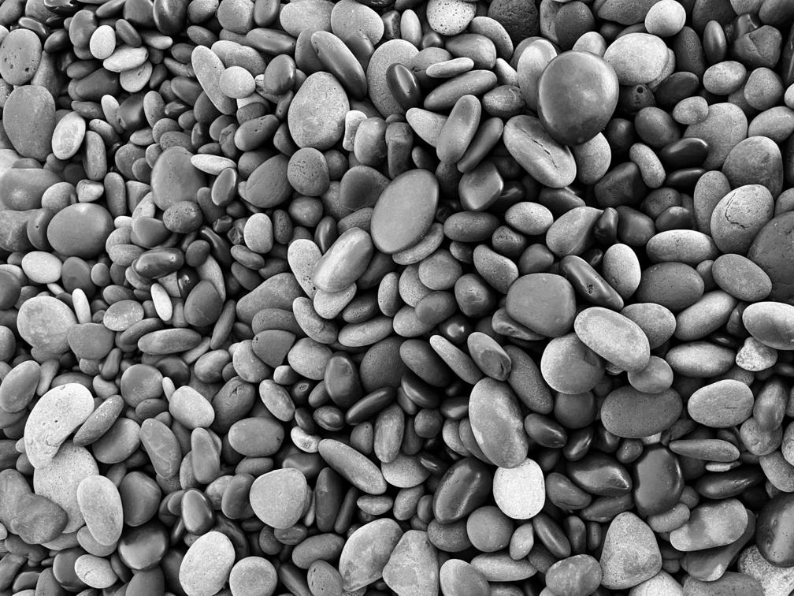
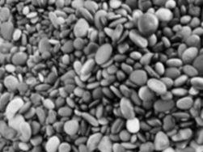
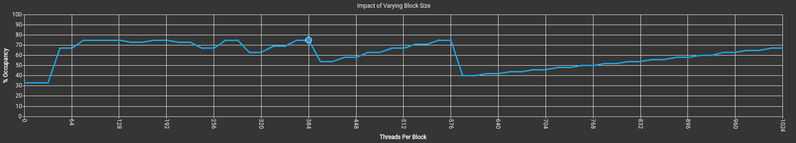
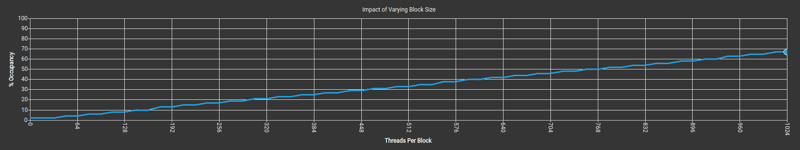

# CUDA Kernel Optimization for Image Convolution

## Overview
* [Motivation](#motivation)
* [Lessons Learned](#lessons-learned)
* [Input image and the Convolution Kernel](#input-image-and-the-convolution-kernel)
* [Benchmark: nppiFilter_8u_C1R](#benchmark-nppifilter_8u_c1r)
* [Kernel 1a: Naive Implementation](#kernel-1a-naive-implementation)
* [Kernel 1b: Naive Implementation with Optimal Launch Parameters](#kernel-1b-naive-implementation-with-optimal-launch-parameters)
* [Kernel 2: Constant Propagation](#kernel-2-constant-propagation)
* [Kernel 3: Tiling 2D](#kernel-3-tiling-2d)
* [Kernel 4: Tiling 1D](#kernel-4-tiling-1d)
* [Work in Progress](#work-in-progress)

## Motivation

Starting this study project, I was inspired by _Simon Boehm_ and his [post](https://siboehm.com/articles/22/CUDA-MMM), in which he was optimizing a CUDA Matmul Kernel trying to achieve cuBLAS performance.

I plan to develop a basic image convolution CUDA kernel and enhance it through iterative optimization techniques. For performance comparison, I will use the _nppiFilter_8u_C1R_ function from the NVIDIA Performance Primitives (NPP) library as a benchmark.

## Lessons Learned

- High occupancy does not guarantee high performance.
- Following common sense could lead to a dramatic performance boost.

## Input image and the Convolution Kernel

As input, I am taking a PGM image. A PGM image (Portable Gray Map) is a straightforward file format for storing 2D grayscale images, with each pixel representing a shade of gray. The single channel of the image simplifies the problem.

I’m using a straightforward yet extended convolution kernel - a _41x41_ box filter. That makes the convolution computationally intense, offering significant room for optimization, and produces a pleasantly blurred output image.
The blurring effect serves as a quick quality control check to confirm that the filter was applied.

I'm working locally using **NVIDIA GeForce RTX 4060 Laptop GPU**.

## Benchmark: nppiFilter_8u_C1R

_nppiFilter_8u_C1R_ is a CPU function, not a GPU kernel. When invoked, it does the following:

- prepares data structures and parameters, including calculating the optimal _gridSize_ and _blockSize_;
- launches pre-compiled kernels optimized for the input image and the specific GPU architecture;
- Handles synchronization and data flow.

The automatically selected kernel _ForEachPixelNaiveInLargeImage_ demonstrated nearly perfect performance:

- **Compute Throughput (%): 99.68**
- **Memory Throughput (%): 99.68**
- **Duration (ms): 93**

It's educative to note the parameters chosen:

- **Grid Size: (125, 373, 1)**
- **Block Size: (32, 8, 1)**
- **Registers (register/thread): 37**

## Kernel 1a: Naive Implementation

In this straightforward approach, each thread processes a specific pixel in the output image. I've set the block size to 32x32 to have 1024 threads, which is a multiple of the warp size (32). Then, I determine the grid size by overlaying the input image with these blocks.

The kernel is not performing enough arithmetic work:

- **Compute Throughput (%): 16.56**
- **Memory Throughput (%): 90.26**
- **Duration (ms): 712**

with the following launch parameters:

- **Grid Size: (126, 95, 1)**
- **Block Size: (32, 32, 1)**
- **Registers (register/thread): 56**

### Occupancy Analysis

Occupancy is a key metric in CUDA programming, representing the ratio of active warps on a Streaming Multiprocessor (SM) to the maximum number of active warps supported by that SM. High occupancy is crucial for performance, as it allows the GPU to effectively hide memory latency by switching to another ready warp whenever one is stalled waiting for data.

The Nsight Compute (NCU) profile for the kernel reveals a low theoretical occupancy of 66.67%. NCU's explanation pinpoints the exact limitations:

 "*The 8.00 theoretical warps per scheduler this kernel can issue according to its occupancy are below the hardware maximum of 12. This kernel's theoretical occupancy (66.7%) is limited by the number of required registers, and the number of warps within each block.*"

This reveals two key things:
- The register usage (56 registers/thread) is too high. This limits the number of warps that can be resident on an SM at a time, directly reducing occupancy.
- The number of warps per thread block (32 warps for a 1024-thread block) is also a factor. While 32 is a good number, if the total number of blocks is low, it can prevent full occupancy.

The achieved occupancy further drops slightly to 64.33%. This drop from the theoretical value is common and can be attributed to runtime factors such as warp divergence, memory stalls, or scheduler inefficiencies that occur during kernel execution.

Ultimately, the goal is to follow the guidance provided by NCU: 'Increase the theoretical number of warps per scheduler that can be issued.' 

Additional metrics:

- **Block Limit Registers (block): 1**. This means only one thread block can fit on an SM at a time. 
- **Block Limit Shared Mem (block): 8**. This shows that if my kernel were only limited by its shared memory usage, 8 blocks could theoretically run concurrently on a single SM.
- **Block Limit Warps (block): 1**. This indicates that my kernel's block size of 1024 threads is equal to the maximum number of threads an SM can execute at once. Note, the Ada Lovelace architecture of my RTX 4060 can have up to 64 active warps per SM.
- **Block Limit SM (block):	24**. This metric represents the maximum number of thread blocks that can be active on an SM, based on the architecture of the GPU itself. It shows that my kernel is nowhere near the SM's physical block limit.

## Kernel 1b: Naive Implementation with Optimal Launch Parameters

My achieved occupancy (64.33%) is very close to the theoretical occupancy (66.7%). This suggests that the kernel is performing well, and my primary bottleneck is the theoretical limit itself.

The primary reason for my low occupancy is the high number of registers per thread. On my RTX 4060's SM, the total number of registers is limited (65,536). When my kernel requires 56 registers for each of its 1024 threads, the total number of registers per thread block is 1024 threads × 56 registers/thread = 57,344 registers. Since an SM has 65,536 registers, it can only hold one thread block at a time (57,344 / 65,536 = 1.14), which rounds down to one. Because only one block can be active at a time, my SM is running a maximum of 32 warps (1024 threads / 32 threads per warp; the NCU report shows Achieved Active Warps per SM equal to 30.88). This is far below the hardware maximum of 64 warps on a single SM of my GPU.

To increase occupancy, I need to reduce the resource usage per block. I have two main options:

- **Reduce Registers**. The most straightforward way is to refactor the kernel, but this is a task for the next exercise. Another option is to address compiler flags, but then I'm facing potential _register spilling_.
- **Reduce Block Size**. I'll follow this approach and use the Occupancy Calculator to find the optimal launch parameters for the given kernel.

### Occupancy Analysis

The Occupancy Calculator suggests a few options for optimal threads per block, each of which leads to a theoretical occupancy of 75%:

The occupancy plot reveals a non-linear relationship. The occupancy first remains constant at 33% until it reaches 32 threads per block. This plateau is a direct consequence of the GPU's hardware-based scheduling of warps; the kernel's resource usage allows for only three warps to be resident on the SM, regardless of a block size from 1 to 32 threads.

After 32 threads, the occupancy increases linearly to 67% until 48 threads per block. This rise indicates that the kernel's resource requirements now allow for a higher number of resident warps. The occupancy then varies with peaks and valleys as the block size increases. These fluctuations are typical when the thread block size is not a clean multiple of the warp size (32), causing less-than-optimal resource utilization due to the GPU’s allocation granularity.

Finally, the occupancy drops to 40% at 576 threads per block, after which it begins to increase linearly once more. The linear increase from this point onward signifies that the total number of threads per SM has become the primary limiting factor. Up until this point, the occupancy was dictated by other resource constraints, such as registers or shared memory, but at a block size of 592 and beyond, the kernel is no longer resource-bound and is limited by how many threads can physically fit on the SM.

### Getting Optimal Block Size

I'm picking 384 threads because this is a multiple of both 32 and 64, which is generally good for memory coalescing and warp scheduling.

For a block size of 384 threads, the register usage per block drops to _384 threads × 56 registers/thread = 21,504 registers_. This would allow my SM to run _three_ thread blocks simultaneously, increasing the number of active warps to _3 blocks × 12 warps/block = 36 warps_. With that, the theoretical occupancy is _36 active warps / 48 max warps = 75%_.

The next decision is to pick the optimal layout for the block. Given my problem - image convolution - I'm taking _dim3(32, 12)_ because it promotes coalesced memory access. This configuration has a width of 32 threads. When threads with _threadIdx.x_ from 0 to 31 are working on the same row of the image, they will naturally be accessing consecutive memory locations. This allows the GPU to perform a single, efficient memory transaction to load the data for the entire warp. Other configurations (e.g., 16x24) break the coalesced memory access pattern.

The optimized launch parameters allowed me to achieve an occupancy of 72.38%. However, that yielded only a minor performance improvement:

- **Compute Throughput (%): 16.77**
- **Memory Throughput (%): 90.46**
- **Duration (ms): 703**

with the following launch parameters:

- **Grid Size: (126, 252, 1)**
- **Block Size: (32, 12, 1)**
- **Registers (register/thread): 56**

The most important lesson from this analysis is that high occupancy does not guarantee high performance. My kernel's poor performance is primarily due to its memory-bound nature, and its low occupancy is a symptom of excessive resource consumption, specifically a high register count.

The Occupancy Calculator models that a decrease in my kernel's register usage from 56 to 48 could increase my theoretical occupancy to 83.33%. The next major milestone is to target 100% occupancy, which would require bringing my register usage down to 40 or fewer registers per thread. Note that this aligns with the register usage of the optimized NPP library (37 registers used).

## Kernel 2: Constant Propagation

In the naive implementation, I'm declaring the filter as an array inside the kernel. This array contains a constant value, but it is naively declared per-thread, and the values are calculated within each thread.

Each thread declares a float array, which forces a large allocation of local memory. This memory is a resource that limits occupancy. A 41x41 float array is _1681×4 bytes = 6724 bytes per thread_. My NVIDIA GeForce RTX 4060 has a hardware limit of 255 registers per thread, which is _255×4 bytes = 1020 bytes_. Since my filter array is over 6.5 times this limit, the compiler will spill this array to local memory. Local memory is private to each thread but is physically located in the slow, off-chip global memory. In result, I am getting a very significant amount of slow memory usage, which drastically reduces the number of warps that can be active on a Streaming Multiprocessor (SM) at any given time.

The straightforward optimization is to get rid of the array and operate with a single constant float value. To do this, I declare the filter value at the host code and pass it to the device. With this approach, the CUDA compiler and runtime can place the constant in fast, on-chip constant memory. This memory is highly optimized for read-only data that is uniform across a warp, allowing a single value to be broadcast to all 32 threads in a single, efficient operation.

This simple change resolved the memory bottleneck, shifting the kernel's execution to become compute-bound:

- **Compute Throughput (%): 88.33**
- **Memory Throughput (%): 66.11**
- **Duration (ms): 71**

with the following launch parameters:

- **Grid Size: (126, 252, 1)**
- **Block Size: (32, 12, 1)**
- **Registers (register/thread): 33**

To launch the kernel, I used a launch configuration with 384 threads per block recommended at the previous step.
That allowed for the achieved occupancy of 97.4% directly leading to an impressive 10x speedup.

The critical observation is the register usage dropped from 56 to 33. In the naive implementation, the large filter array forced the compiler to use a large number of registers. After transitioning to a constant value, the compiler no longer needed to allocate those registers, which freed up resources and led to a higher occupancy.

In fact, I've achieved this dramatic performance boost by following a common sense approach.

At this optimization state, NCU recommends to "balance the number of active cycles across L2 Slices," which suggests the kernel's performance is now being limited by the efficiency of the L2 cache utilization.

## Kernel 3: Tiling 2D

This kernel follows a tiling strategy. It breaks the large input image into smaller, overlapping chunks called "tiles":
- **Load Phase**: Each thread block loads its corresponding tile from global memory into shared memory.
- **Compute Phase**: Each thread within the block then performs the computation using the data from the fast shared memory instead of repeatedly accessing the slow global memory.

During the Load Phase, the data is read in a coalesced manner to allow threads in a warp to access contiguous memory addresses. For the filter, I am following the constant propagation strategy.

The kernel uses a shared memory array. With the filter size 41x41 and a tile size of 32x32, that requires _(32 + 41 - 1) * (32 + 41 - 1) = 72 * 72 = 5184 bytes_. For my RTX 4060, each SM has 100 KB of configurable L1 cache/shared memory. The kernel's shared memory usage of ~5 KB per block is well within this limit.

The kernel appears well-balanced with high throughput values:

- **Compute Throughput (%): 93.01**
- **Memory Throughput (%): 93.01**
- **Duration (ms): 51**

with the following launch parameters:

- **Grid Size: (126, 95, 1)**
- **Block Size: (32, 32, 1)**
- **Registers (register/thread): 36**

The Occupancy Calculator reveals a linear dependency between Occupancy and the number of Threads per Block:

This is a feature of shared memory, which becomes the new limiting factor for occupancy. Unlike registers, which are allocated on a per-thread basis, shared memory is allocated per thread block. The amount of shared memory a block requests is a single, fixed value, regardless of the number of threads within that block. Occupancy increases linearly as more threads are added to each block, until it hits a new limit (1024 threads per block). Note that the theoretical occupancy drops to 66.7% even with the observed significant speedup.

## Kernel 4: Tiling 1D

The previous kernel used a 2D strided loop, which provided a basic form of memory coalescing but could be suboptimal. My new kernel improves upon this by using a single 1D loop with a linear index, which guarantees more efficient memory coalescing.

This change in memory access pattern yielded significant improvements in L2 cache performance:
- **L2 Cache Throughput increased by 1.7%**: This metric measures the rate of data transfer to and from the GPU's L2 cache. The increase indicates that the 1D tiling kernel, kernelTiling1D, is making more effective use of the available L2 cache bandwidth.
- **Average L2 Active Cycles decreased by 13.2%**: This metric reflects the average number of clock cycles the L2 cache is occupied. The significant reduction indicates the kernel experiences fewer stalls and wait times for L2 cache access, which is a direct result of the more optimized memory access pattern.

These memory optimizations led to slight improvements in overall performance:

- **Compute Throughput (%): 93.37**
- **Memory Throughput (%): 93.37**
- **Duration (ms): 51**

with the following launch parameters:

- **Grid Size: (126, 95, 1)**
- **Block Size: (32, 32, 1)**
- **Registers (register/thread): 36**

## Work in Progress

After adapting the tiling strategy, I'm getting the Profiler's guidance to "balance the number of active cycles across L2 Slices."

L2 cache slices are partitions of the GPU's L2 cache. Instead of a single, monolithic L2 cache, the total cache capacity is divided into multiple independent sections. Each slice is a physically separate part of the cache with its own set of memory controllers. When a memory request comes from an SM, a hashing function is used to determine which L2 cache slice contains the requested data. This function ensures that memory addresses are distributed across the slices, allowing for more concurrent access. At my RTX 4060 Laptop GPU, with Ada Lovelace architecture, the L2 cache size is 24 MB.